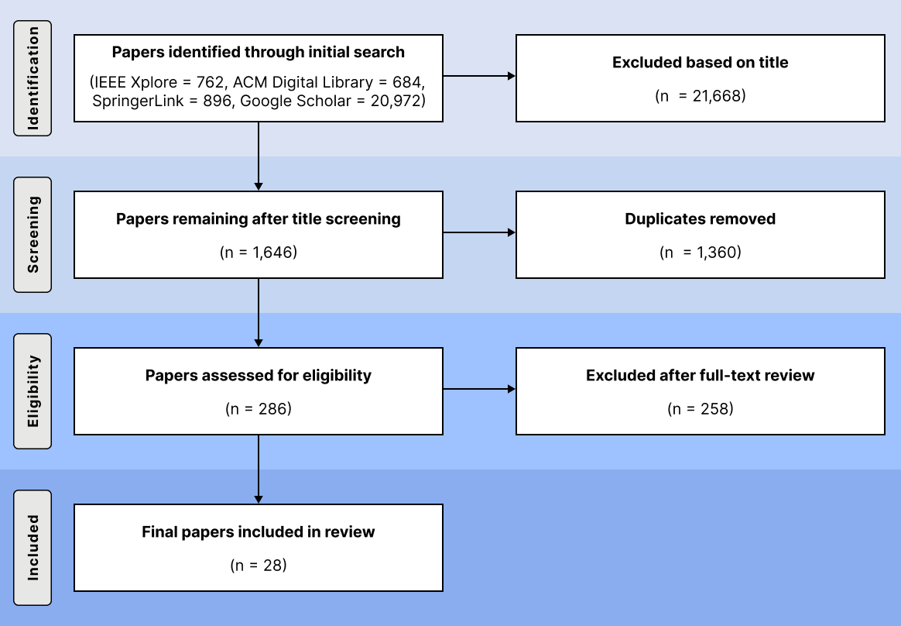

# AI-based Quantum Error Mitigation — PRISMA Data

Literature selection data for a systematic review on AI-based **Quantum Error Mitigation (QEM)** methods, conducted following the PRISMA guidelines.

## Folder structure

```
prisma/
├── 01_keyword_search/      S1.xlsx  — raw search results (n = 23,314)
├── 02_title_check/ S2.xlsx — titles matching the QEM/QNM term pattern (n = 1,646)
├── 03_duplicate_removal/   S3.csv — duplicates within and across databases removed (n = 286)
└── 04_fulltext_screening/  S4.csv  — final included set (n = 28)
figs/
└── prisma_flow.png
```

Each stage's CSV contains the publications that passed that step.

## 1) Search

- **Databases:** IEEE Xplore, ACM Digital Library, Springer Nature Link, Google Scholar
- **Period:** January 2021 – May 2026

**Query**

```text
("Quantum Error Mitigation" OR "QEM" OR "Quantum Noise Mitigation")
AND
("Machine Learning" OR "Deep Learning" OR "Neural Network"
 OR "Artificial Intelligence" OR "ML" OR "DL" OR "Neural" OR "AI")
```

## 2) Selection pipeline

| # | Stage | What we did |
|---|---|---|
| S1 | Keyword search | Pulled all records returned by the four databases for the query above (23,314 records). |
| S2 | Title check | Removed records whose titles do not match `(("Quantum" AND "Error" AND "Mitigation") OR "QEM" OR ("Quantum" AND "Noise" AND "Mitigation"))`, leaving 1,646 records. |
| S3 | Duplicate removal | Removed 1,360 duplicate records occurring within and across databases, leaving 286 records. |
| S4 | Full-text review | Reviewed the full texts of the 286 records; excluded 258 that did not meet the inclusion criteria below, leaving 28. |

## 3) PRISMA workflow and screening pipeline

The four selection stages above map to the standard PRISMA phases. The figure below summarizes the full pipeline.



### 3.1) Stage-by-stage breakdown

| PRISMA phase | Stage | Output |
|---|---|---|
| Identification | S1 — Keyword search | `01 keyword_search/S1.xlsx` |
| Screening | S2 — Title check | `02 title_check/S2.xlsx` |
| Screening | S3 — Duplicate removal | `03 duplicate_removal/S3.csv` |
| Eligibility / Included | S4 — Full-text review | `04_fulltext_screening/S4.csv` |

Each CSV contains the records that survived the corresponding step.

## 4) Final inclusion criteria

The records in `04_fulltext_screening/S4.csv` represent the final set after full-text review. A study was included only if it met all four:

1. Written in English and published in a peer-reviewed journal or conference.
2. Is a full paper — short papers (≤ 4 pages excluding references), abstracts, posters, and workshop papers were excluded. Workshop papers were identified from the manuscript header or venue information.
3. Applies machine learning or deep learning techniques to QEM.
4. Provides concrete implementation details and experimental results of the proposed method.

