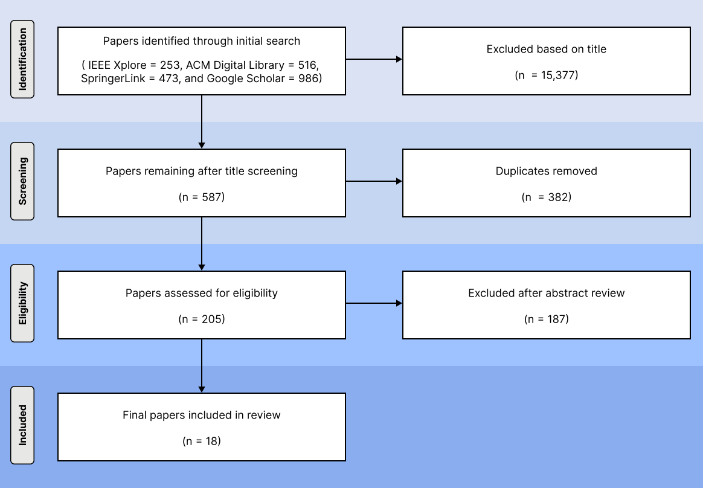

# AI-based Quantum Error Mitigation — PRISMA Data

Literature selection data for a systematic review on AI-based **Quantum Error Mitigation (QEM)** methods, conducted following the PRISMA guidelines.

## Folder structure

```
prisma/
├── 01_keyword_search/      S1.csv  — raw search results
├── 02_title_check/         S2.csv  — kept only titles containing "quantum"
├── 03_duplicate_removal/   S3.csv  — duplicates across databases removed
└── 04_abstract_analysis/   S4.csv  — kept after title & abstract review
```

Each stage's CSV contains the publications that passed that step.

## 1) Search

- **Databases:** IEEE Xplore, ACM Digital Library, SpringerLink, Google Scholar
- **Period:** 2021 – November 2025
- **Query:**

  ```
  ("Quantum Error Mitigation" OR "QEM")
  AND
  ("Machine Learning" OR "Deep Learning" OR "Neural Network"
   OR "Artificial Intelligence" OR "ML" OR "DL" OR "Neural" OR "AI")
  ```

## 2) Selection pipeline

| # | Stage | What we did |
|---|---|---|
| S1 | Keyword search | Pulled all records returned by the four databases for the query above. |
| S2 | Title check | Removed records whose titles do not contain the word *quantum*. |
| S3 | Duplicate removal | Removed duplicate records appearing in more than one database. |
| S4 | Abstract analysis | Reviewed titles and abstracts; kept records relevant to AI-based QEM. |

## 3) PRISMA workflow and screening pipeline

The four selection stages above operationalize the **Identification** and **Screening** phases of PRISMA. The figure below summarizes the full pipeline including the Eligibility phase (full-text review) and the final Included set.



### 3.1) Stage-by-stage breakdown

| PRISMA phase | Pipeline stage | Output file | Records |
|---|---|---|---:|
| Identification | S1 — Keyword search | `01_keyword_search/S1.csv` | from four databases |
| Screening | S2 — Title check | `02_title_check/S2.csv` | 587 |
| Screening | S3 — Duplicate removal | `03_duplicate_removal/S3.csv` | 205 |
| Eligibility | S4 — Abstract analysis + full-text review | `04_abstract_analysis/S4.csv` | 205 → 18 |
| Included | Final set | — | 18 |

Reductions at each stage are deliberate and traceable: every CSV contains the records that **survived** the corresponding step, so the difference between two consecutive files corresponds to the records excluded at that step.

### 3.2) What is *not* included in this repository

- **Per-record rejection reasons.** Individual exclusion notes were tracked separately and are not published with this dataset.
- **Full-text PDFs.** Only bibliographic metadata is provided. The PDFs themselves are available through each publisher.
- **Reviewer-level annotations.** Title and abstract decisions were resolved by the authors; only the consolidated outcome of each stage is provided here.

## 4) Final inclusion criteria

The records in `04_abstract_analysis/S4.csv` were further screened by full-text review. A study was included in the final analysis only if it met all three:

1. Written in English and published in a peer-reviewed journal or conference.
2. Applies deep learning or machine learning techniques to QEM.
3. Provides concrete implementation details and experimental results.

